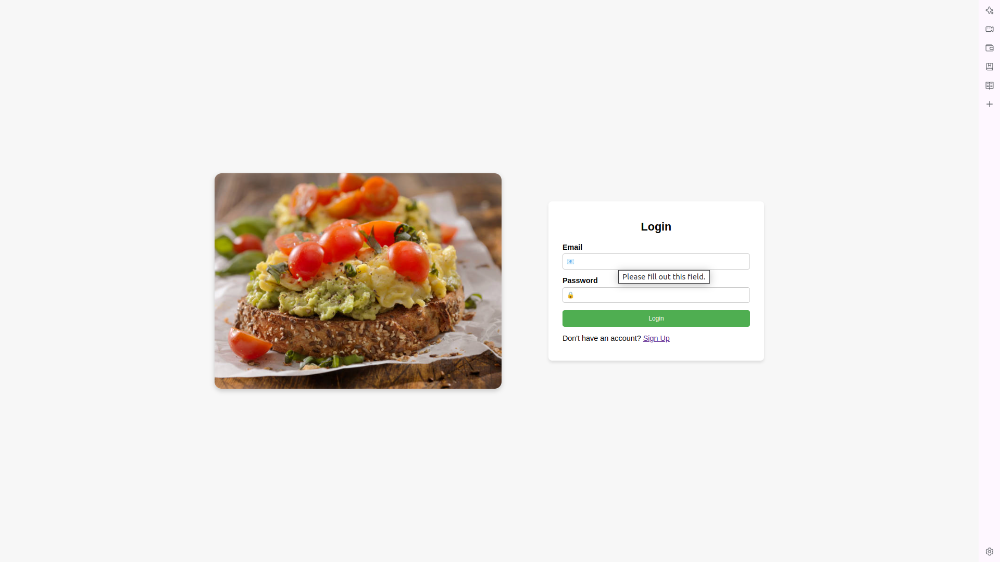
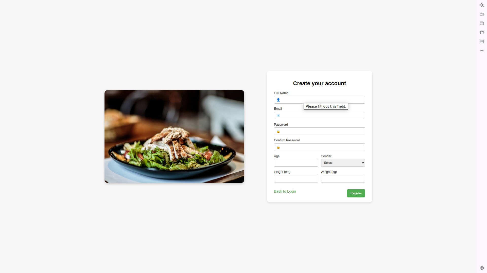
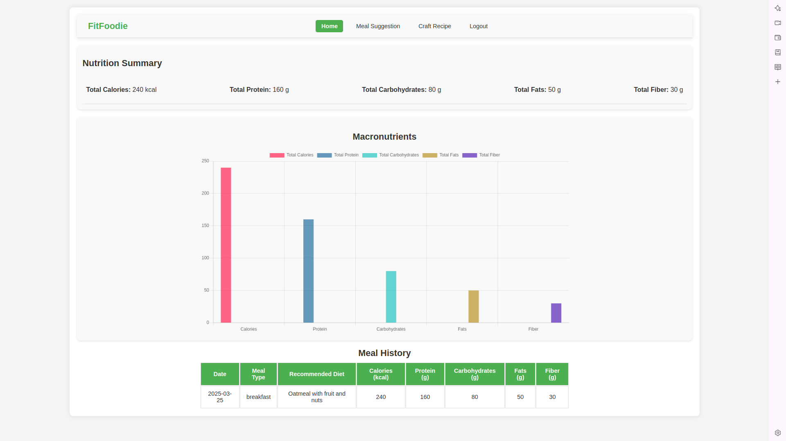
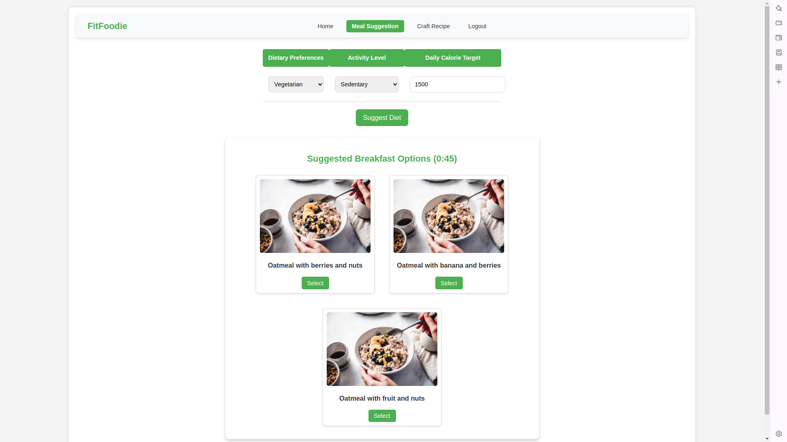
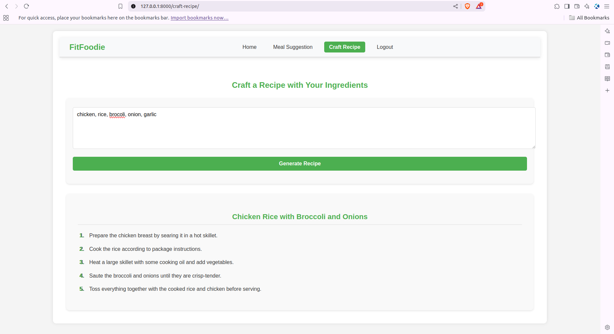

## Diet Suggestor
---

### Getting Started

#### 1. Clone the Repository
```bash
# for windows
git clone https://github.com/yubraaj11/DietSuggestor.git

# for linux
git clone git@github.com:yubraaj11/DietSuggestor.git

# change the working directory
cd DietSuggestor
```

#### 2. Create Virtual Env
##### a. Conda
```bash
conda create -n <name> python=3.11

# activate 
conda activate <name>
```

##### b. Venv
```bash
python -m venv <name>

# activate (for Linux OS)
source <name>/bin/activate

# activate (For Windows)
<name>\Scripts\activate
```

#### 3. Install requirements.txt
```bash
pip install -r requirements.txt
```

#### 4. Run the FastAPI server -  `app.py`
```bash
uvicorn app:app --reload
```
---
### Sample Screenshots

- Login Page


- Register


- Dashboard


- Meal Suggestor


- Craft Recipe


---